# FCND-Controls
3rd Project - Control of a 3D Quadrotor


[Detailed Project Explantion Page](https://github.com/udacity/FCND-Controls)


## Ptyhon Part ##

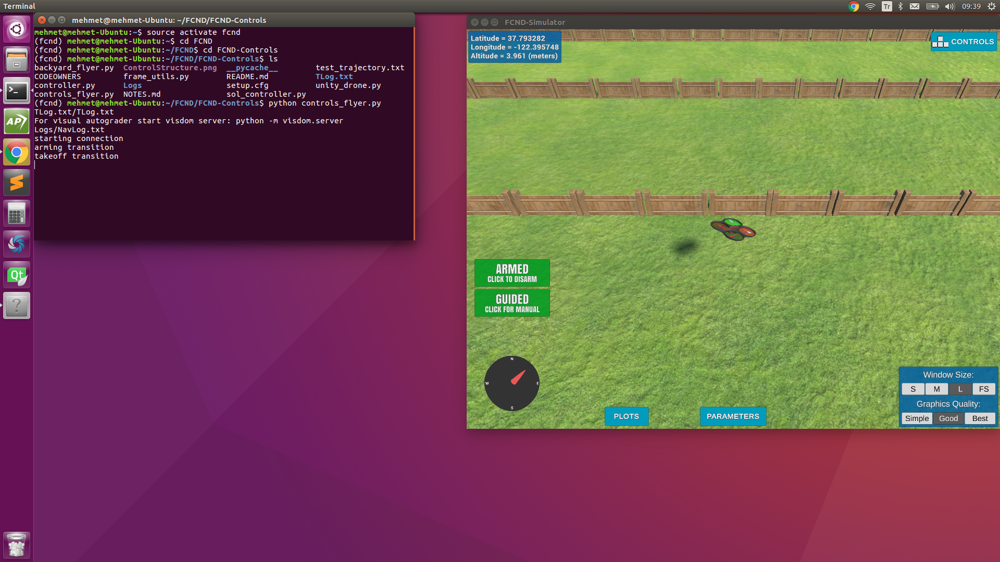 
---

In this part, the nested low-level controller needed to achieve trajectory following is explained. The controller is separated into five parts:

 - body rate control
 - reduced attitude control
 - altitude control
 - heading control
 - lateral position control
 
 The basic block diagram of quadrotor contoller is here
 
  [1]
 
The detailed block diagram of quadrotor controller is here. The theory behind the controller design is given in [this paper](http://www.dynsyslab.org/wp-content/papercite-data/pdf/schoellig-acc12.pdf) [2]
 
  [3]
 
 Each of the methods in [`controller.py`](./python/controller.py) is given below
 
 Reduced Attitude Control Diagram
 
   [3]

* **1- Body Rate Control ( body_rate_control() )**

The commanded roll, pitch, and yaw are collected by the body rate controller, and they are translated into the desired moment along the axis in the body frame. This control method use only P controller.

```py
    def body_rate_control(self, body_rate_cmd, body_rate):
        """ Generate the roll, pitch, yaw moment commands in the body frame
        
        Args:
            body_rate_cmd: 3-element numpy array (p_cmd,q_cmd,r_cmd) in radians/second^2
            body_rate: 3-element numpy array (p,q,r) in radians/second^2
            
        Returns: 3-element numpy array, desired roll moment, pitch moment, and yaw moment commands in Newtons*meters
        """

        rate_err = body_rate_cmd - body_rate

        Kp_rate = np.array([self.Kp_p, self.Kp_q, self.Kp_r])

        m_c = MOI * np.multiply(Kp_rate, rate_err) 

        m_c_value = np.linalg.norm(m_c)

        if m_c_value > MAX_TORQUE:
            m_c = m_c*MAX_TORQUE/m_c_value
        return m_c

```
* **2- Reduced Attitude Control ( roll_pitch_control() )**

The roll-pitch controller is a P controller responsible for commanding the roll and pitch rates ( p_c  and  q_c ) in the body frame. First, it sets the desired rate of change of the given matrix elements using a P controller.

  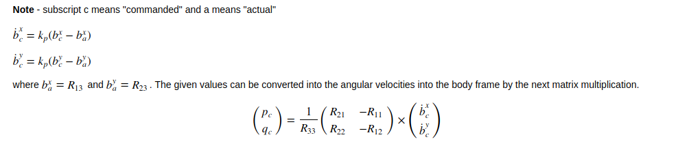 [3]
 
The rotation matrix elements  R13  (also referred to as  b_x ) and  R23  (also referred to as  b_y ). Lateral acceleration commend comes from lateral controller. By using it, b_x_target & b_y_target are obtained. 

  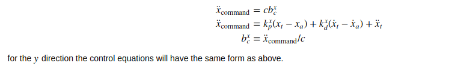 [3]
  
```py
    def roll_pitch_controller(self, acceleration_cmd, attitude, thrust_cmd):
        """ Generate the rollrate and pitchrate commands in the body frame
        
        Args:
            target_acceleration: 2-element numpy array (north_acceleration_cmd,east_acceleration_cmd) in m/s^2
            attitude: 3-element numpy array (roll, pitch, yaw) in radians
            thrust_cmd: vehicle thruts command in Newton
            
        Returns: 2-element numpy array, desired rollrate (p) and pitchrate (q) commands in radians/s
        """

        if thrust_cmd > 0 :

            c = -1 * thrust_cmd / DRONE_MASS_KG  

            # Find R13 (Target_X) and R23 (Target_Y)
            b_x_c_target , b_y_c_target  = np.clip(acceleration_cmd/c, -1, 1)  # min & max tilt (rad) 
             
            #Calculate Rotation Matrix
            rot_mat = euler2RM(attitude[0], attitude[1], attitude[2]) 

            b_x = rot_mat[0,2] # R13 (Actual)
            b_x_err = b_x_c_target - b_x
            b_x_p_term = self.Kp_roll * b_x_err

            b_y = rot_mat[1,2] # R23 (Actual)
            b_y_err = b_y_c_target - b_y
            b_y_p_term = self.Kp_pitch * b_y_err
            
            b_x_cmd_dot = b_x_p_term
            b_y_cmd_dot = b_y_p_term

            rot_mat1=np.array([[rot_mat[1,0],-rot_mat[0,0]],[rot_mat[1,1],-rot_mat[0,1]]])/rot_mat[2,2]
            rot_rate = np.matmul(rot_mat1,np.array([b_x_cmd_dot,b_y_cmd_dot]).T)
            
            p_c = rot_rate[0]
            q_c = rot_rate[1]

        else: 

            p_c = 0 
            q_c = 0
            thrust_cmd = 0

        return np.array([p_c, q_c])
```    
* **3- Altitude Control ( altitude_control() )** 

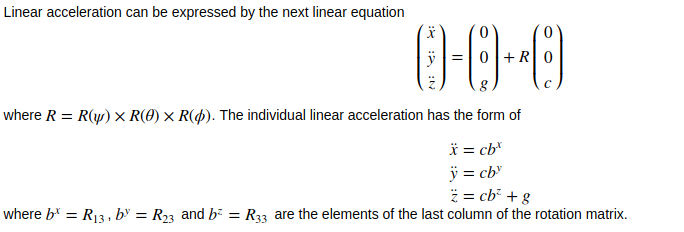 [3]

A PD controller is used for the altitude control

```py
    def altitude_control(self, altitude_cmd, vertical_velocity_cmd, altitude, vertical_velocity, attitude,  acceleration_ff=0.0):
        """Generate vertical acceleration (thrust) command

        Args:
            altitude_cmd: desired vertical position (+up)
            vertical_velocity_cmd: desired vertical velocity (+up)
            altitude: vehicle vertical position (+up)
            vertical_velocity: vehicle vertical velocity (+up)
            attitude: the vehicle's current attitude, 3 element numpy array (roll, pitch, yaw) in radians
            acceleration_ff: feedforward acceleration command (+up)
            
        Returns: thrust command for the vehicle (+up)
        """
        
        alt_error = altitude_cmd - altitude

        p_term = self.Kp_alt * alt_error

        alt_dot_error = vertical_velocity_cmd - vertical_velocity

        d_term = self.Kd_alt * alt_dot_error

        acc_cmd = p_term + d_term + acceleration_ff

        b_z = np.cos(attitude[0]) * np.cos(attitude[1]) #  R33

        thrust = DRONE_MASS_KG * acc_cmd / b_z

        if thrust > MAX_THRUST:
            thrust = MAX_THRUST
        elif thrust < 0.0:
            thrust = 0.0
        return thrust

```  
* **4- Heading Control ( yaw_control() )**

A P controller is used to control the drone's yaw.

```py    
    def yaw_control(self, yaw_cmd, yaw):
        """ Generate the target yawrate
        
        Args:
            yaw_cmd: desired vehicle yaw in radians
            yaw: vehicle yaw in radians
        
        Returns: target yawrate in radians/sec
        """
        yaw_err = yaw_cmd - yaw

        if yaw_err > np.pi:
            yaw_err = yaw_err - 2.0*np.pi
        elif yaw_err < -np.pi:
            yaw_err = yaw_err + 2.0*np.pi
         
        r_c = self.Kp_yaw * yaw_err
        
        # within range of 0 to 2*pi
        r_c = np.clip(r_c, 0, 2*np.pi) 

        return r_c
```

* **5- Lateral Position Control ( lateral_position_control() )**

The drone generates lateral acceleration by changing the body orientation which results in non-zero thrust in the desired direction. A PD controller is used for the lateral controller. 

```py    
    def lateral_position_control(self, local_position_cmd, local_velocity_cmd, local_position, local_velocity,
                               acceleration_ff = np.array([0.0, 0.0])):
        """Generate horizontal acceleration commands for the vehicle in the local frame

        Args:
            local_position_cmd: desired 2D position in local frame [north, east]
            local_velocity_cmd: desired 2D velocity in local frame [north_velocity, east_velocity]
            local_position: vehicle position in the local frame [north, east]
            local_velocity: vehicle velocity in the local frame [north_velocity, east_velocity]
            acceleration_cmd: feedforward acceleration command
            
        Returns: desired vehicle 2D acceleration in the local frame [north, east]
        """

        lateral_pos_error = local_position_cmd - local_position

        p_term = self.Kp_lateral_pos * lateral_pos_error

        lateral_pos_dot_error = local_velocity_cmd - local_velocity

        d_term = self.Kd_lateral_pos * lateral_pos_dot_error

        acc_cmd = p_term + d_term + acceleration_ff


        return acc_cmd
```
**Parameter Tuning**

Controller parameters is tuned from lowest level to highest level.Observing the affect of each controller saperatly, [`test_trajectory.txt`](./python/test_trajectory.txt) is changed to controller attempt to hold at a fixed point just about the origin for each . Beacuse it is hard to see the effects of controllers with [`test_trajectory.txt`](./python/test_trajectory.txt) in tunining process. 

```py    
        self.local_position_target = np.array([0.0, 0.0, -3.0]) # Test Purpose
```
"Tuning a faster and smoother inner loop will make tuning the outer loop easier due to less decoupling of the modes." [4]

For each controller gain is found by trail and error methods . Also parameter tuning practices are used from Lesson 12 - Section 17 [5] 


```  
   PD Math and Reparametrization 
       
       err_dot_dot + Kd * err_dot + Kp * err = 0
       
       Kd = 2 * damping_ratio * undamped_natural_freq
       
       Kp = (undamped_natural_freq)**2
       
```

``` 
   Parameter Tuning Best Practices   
       
      * 1 - 0.7 < damping_ratioa < 1.0
      
      * 2 - choose a large undamped_natural_freq
      
          T = 1 / undamped_natural_freq
          
          Trise = 1.57 * T
       
```

**Evaluation**

* Maximum Horizantol Error < 2 m
* Maximum Vertical Error < 1 m
* Mission Time < 20 s

The telemetry log of a successful trajectory following flight is here [(TLog.txt)](./python/TLog.txt)

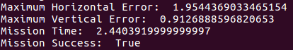


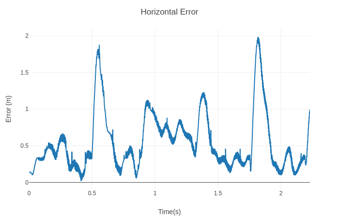

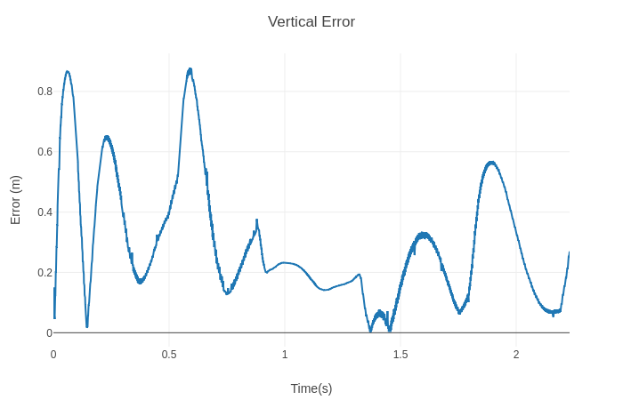

**Video**
[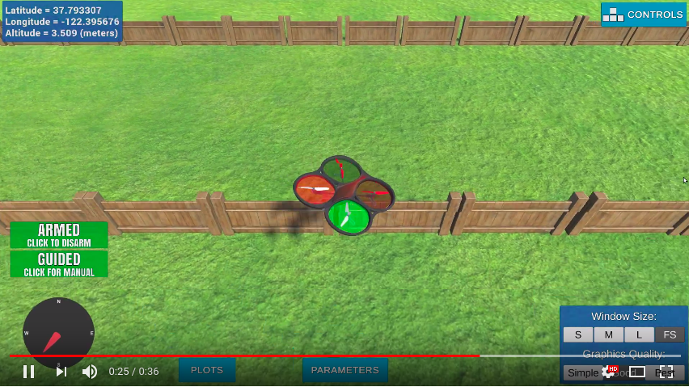](https://www.youtube.com/watch?v=FtIspS_226Y&feature=youtu.be)


## CPP Part ##

 Each of the methods in [`QuadControl.cpp`](./cpp/QuadControl.cpp) is given below
 
**Senario 1 : Intro**

In this senario , the mass of quadrotor is adjusted to make the quad more or less stay in the same spot.

With the proper `mass = 0.5`.

<p align="center">
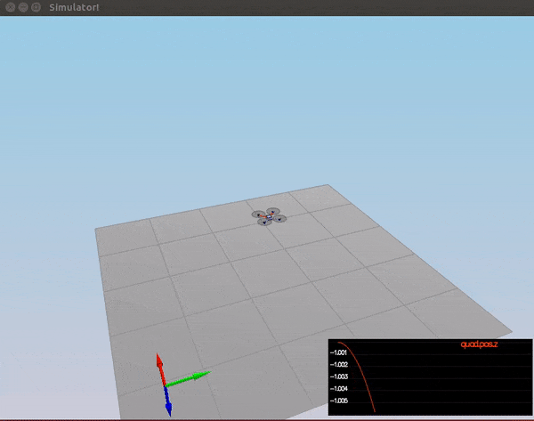
</p>

Performance Evaluation:

Result: 


**Senario 2 : Attitude Control**

In this senario , quadrotor is created with a small initial rotation speed about its roll axis. The body rate and roll / pitch control is implemented to stabilize the rotational motion and bring the quad back to level attitude. 

 1- `GenerateMotorCommands()`
 
In this function , the individual motor thrust commands is set.The drone rotor positions are swapped in this project versus the 3D lesson [3] The rotor positions are given below

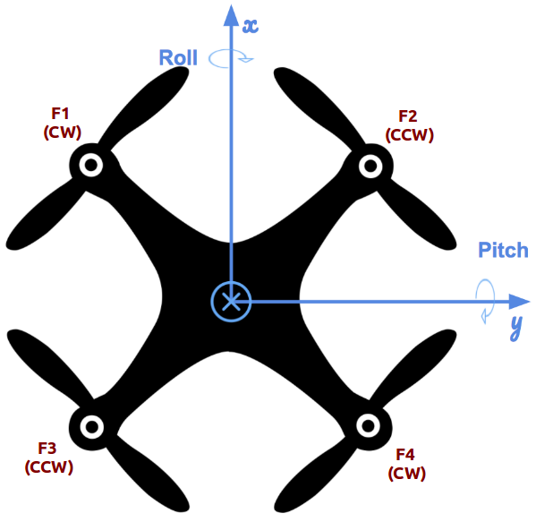

The total thrust and the moments created by the propellers;

* F_total = F1 + F2 + F3 + F4
* tau_x= (F1 - F2 + F3 - F4) * l
* tau_y= (F1 + F2 - F3 - F4) * l
* tau_z= - ( F1 - F2 - F3 + F4 ) * kappa  // the z axis is inverted tso that moment on z was inverted here


```cpp    
VehicleCommand QuadControl::GenerateMotorCommands(float collThrustCmd, V3F momentCmd)
{
  // Convert a desired 3-axis moment and collective thrust command to 
  //   individual motor thrust commands
  // INPUTS: 
  //   desCollectiveThrust: desired collective thrust [N]
  //   desMoment: desired rotation moment about each axis [N m]
  // OUTPUT:
  //   set class member variable cmd (class variable for graphing) where
  //   cmd.desiredThrustsN[0..3]: motor commands, in [N]

  // HINTS: 
  // - you can access parts of desMoment via e.g. desMoment.x
  // You'll need the arm length parameter L, and the drag/thrust ratio kappa

  ////////////////////////////// BEGIN STUDENT CODE ///////////////////////////

  float l = L / sqrt(2.f); // Lesson 11 - Section 20

  // The drone rotor positions are swapped in project versus the 3D lesson!

    float c_bar = collThrustCmd;  // F1 + F2 + F3 + F4
    float p_bar = momentCmd.x / l; // F1 - F2 + F3 - F4
    float q_bar = momentCmd.y / l;  // F1 + F2 - F3 - F4
    float r_bar = -momentCmd.z / kappa; // F1 - F2 - F3 + F4
    
    cmd.desiredThrustsN[0] = (c_bar + p_bar + q_bar + r_bar) / 4.f; // front left
    cmd.desiredThrustsN[1] = (c_bar - p_bar + q_bar - r_bar) / 4.f; // front right
    cmd.desiredThrustsN[2] = (c_bar + p_bar - q_bar - r_bar) / 4.f; // rear left
    cmd.desiredThrustsN[3] = (c_bar - p_bar - q_bar + r_bar) / 4.f; // rear right

  /////////////////////////////// END STUDENT CODE ////////////////////////////

  return cmd;
}
```
2- `BodyRateControl()`

The commanded roll, pitch, and yaw are collected by the body rate controller, and they are translated into the desired moment along the axis in the body frame. This control method use only P controller.

The same method is used in python section `1- Body Rate Control ( body_rate_control() )`

```cpp    
V3F QuadControl::BodyRateControl(V3F pqrCmd, V3F pqr)
{
  // Calculate a desired 3-axis moment given a desired and current body rate
  // INPUTS: 
  //   pqrCmd: desired body rates [rad/s]
  //   pqr: current or estimated body rates [rad/s]
  // OUTPUT:
  //   return a V3F containing the desired moments for each of the 3 axes

  // HINTS: 
  //  - you can use V3Fs just like scalars: V3F a(1,1,1), b(2,3,4), c; c=a-b;
  //  - you'll need parameters for moments of inertia Ixx, Iyy, Izz
  //  - you'll also need the gain parameter kpPQR (it's a V3F)

  V3F momentCmd;

  ////////////////////////////// BEGIN STUDENT CODE ///////////////////////////

  V3F MOI = V3F(Ixx, Iyy, Izz);
  V3F pqr_err = pqrCmd - pqr ;
  V3F m_c = kpPQR * pqr_err ;

  momentCmd = MOI * m_c ;
  /////////////////////////////// END STUDENT CODE ////////////////////////////

  return momentCmd;
}
```
3- `RollPitchControl()`

The roll-pitch controller is a P controller responsible for commanding the roll and pitch rates ( pqrCmd.x  and  pqrCmd.y) in the body frame. 

The same method is used in python section `2- Reduced Attitude Control ( roll_pitch_control() )`

```cpp    
// returns a desired roll and pitch rate 
V3F QuadControl::RollPitchControl(V3F accelCmd, Quaternion<float> attitude, float collThrustCmd)
{
  // Calculate a desired pitch and roll angle rates based on a desired global
  //   lateral acceleration, the current attitude of the quad, and desired
  //   collective thrust command
  // INPUTS: 
  //   accelCmd: desired acceleration in global XY coordinates [m/s2]
  //   attitude: current or estimated attitude of the vehicle
  //   collThrustCmd: desired collective thrust of the quad [N]
  // OUTPUT:
  //   return a V3F containing the desired pitch and roll rates. The Z
  //     element of the V3F should be left at its default value (0)

  // HINTS: 
  //  - we already provide rotation matrix R: to get element R[1,2] (python) use R(1,2) (C++)
  //  - you'll need the roll/pitch gain kpBank
  //  - collThrustCmd is a force in Newtons! You'll likely want to convert it to acceleration first

  V3F pqrCmd;
  Mat3x3F R = attitude.RotationMatrix_IwrtB();

  ////////////////////////////// BEGIN STUDENT CODE ///////////////////////////

    if ( collThrustCmd > 0 ) {

      float c = - collThrustCmd / mass;
       
      // Find R13 (Target_X) and R23 (Target_Y)
      float b_x_c_target = CONSTRAIN(accelCmd.x / c, -maxTiltAngle, maxTiltAngle);
      float b_y_c_target = CONSTRAIN(accelCmd.y / c, -maxTiltAngle, maxTiltAngle);

      float b_x = R(0,2); // R13 ( Actual X )
      float b_x_err = b_x_c_target - b_x;
      float b_x_p_term = kpBank * b_x_err;
    
      float b_y = R(1,2); // R23 ( Actual Y )
      float b_y_err = b_y_c_target - b_y;
      float b_y_p_term = kpBank * b_y_err;
    
      pqrCmd.x = (R(1,0) * b_x_p_term - R(0,0) * b_y_p_term) / R(2,2);
      pqrCmd.y = (R(1,1) * b_x_p_term - R(0,1) * b_y_p_term) / R(2,2);
    } else {
      pqrCmd.x = 0.0;
      pqrCmd.y = 0.0;
    }

  /////////////////////////////// END STUDENT CODE ////////////////////////////

  return pqrCmd;
}
```
With the proper gains `kpPQR = 95, 95, 6` and `kpBank = 10`.

<p align="center">
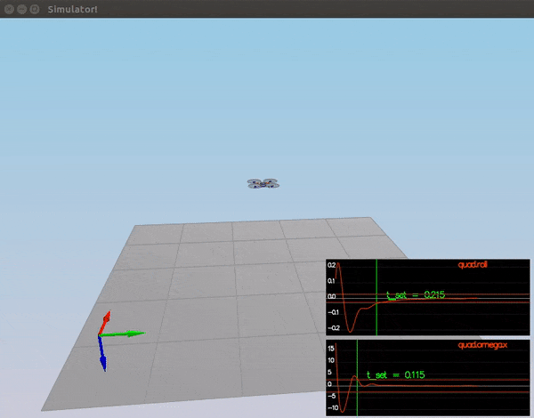
</p>

Performance Evaluation:

* roll should less than 0.025 radian of nominal for 0.75 seconds (3/4 of the duration of the loop)
* roll rate should less than 2.5 radian/sec for 0.75 seconds

Result: 

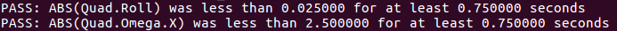


**Senario 3 : Position Control**

In this senario , the position, altitude and yaw control are implemted to quadrotor.  

1-`LateralPositionControl()`

The drone generates lateral acceleration by changing the body orientation which results in non-zero thrust in the desired direction. A PD controller is used for the lateral controller.

The same method is used in python section `5- Lateral Position Control ( lateral_position_control() ) )`. But XY speed and acceleration are limited. 

```cpp    
// returns a desired acceleration in global frame
V3F QuadControl::LateralPositionControl(V3F posCmd, V3F velCmd, V3F pos, V3F vel, V3F accelCmdFF)
{
  // Calculate a desired horizontal acceleration based on 
  //  desired lateral position/velocity/acceleration and current pose
  // INPUTS: 
  //   posCmd: desired position, in NED [m]
  //   velCmd: desired velocity, in NED [m/s]
  //   pos: current position, NED [m]
  //   vel: current velocity, NED [m/s]
  //   accelCmdFF: feed-forward acceleration, NED [m/s2]
  // OUTPUT:
  //   return a V3F with desired horizontal accelerations. 
  //     the Z component should be 0
  // HINTS: 
  //  - use the gain parameters kpPosXY and kpVelXY
  //  - make sure you limit the maximum horizontal velocity and acceleration
  //    to maxSpeedXY and maxAccelXY

  // make sure we don't have any incoming z-component
  accelCmdFF.z = 0;
  velCmd.z = 0;
  posCmd.z = pos.z;

  // we initialize the returned desired acceleration to the feed-forward value.
  // Make sure to _add_, not simply replace, the result of your controller
  // to this variable
  V3F accelCmd = accelCmdFF;

  ////////////////////////////// BEGIN STUDENT CODE ///////////////////////////

   V3F pos_err = posCmd - pos ;

   if (velCmd.mag() > maxSpeedXY) {
      velCmd = velCmd.norm() * maxSpeedXY;
    }
   
  V3F vel_err = velCmd - vel ;

  accelCmd = kpPosXY * pos_err + kpVelXY * vel_err + accelCmd ;

    if (accelCmd.mag() > maxAccelXY) {
      accelCmd = accelCmd.norm() * maxAccelXY;
    }

   accelCmd.z = 0;  

  /////////////////////////////// END STUDENT CODE ////////////////////////////

  return accelCmd;
}
```

2-`AltitudeControl()`

A PID controller is used for the altitude control [6] Unlike the Python part, the integral term is added and acceleration is limited. 

```cpp    
float QuadControl::AltitudeControl(float posZCmd, float velZCmd, float posZ, float velZ, Quaternion<float> attitude, float accelZCmd, float dt)
{
  // Calculate desired quad thrust based on altitude setpoint, actual altitude,
  //   vertical velocity setpoint, actual vertical velocity, and a vertical 
  //   acceleration feed-forward command
  // INPUTS: 
  //   posZCmd, velZCmd: desired vertical position and velocity in NED [m]
  //   posZ, velZ: current vertical position and velocity in NED [m]
  //   accelZCmd: feed-forward vertical acceleration in NED [m/s2]
  //   dt: the time step of the measurements [seconds]
  // OUTPUT:
  //   return a collective thrust command in [N]

  // HINTS: 
  //  - we already provide rotation matrix R: to get element R[1,2] (python) use R(1,2) (C++)
  //  - you'll need the gain parameters kpPosZ and kpVelZ
  //  - maxAscentRate and maxDescentRate are maximum vertical speeds. Note they're both >=0!
  //  - make sure to return a force, not an acceleration
  //  - remember that for an upright quad in NED, thrust should be HIGHER if the desired Z acceleration is LOWER

  Mat3x3F R = attitude.RotationMatrix_IwrtB();
  float thrust = 0;

  ////////////////////////////// BEGIN STUDENT CODE ///////////////////////////

  float alt_err = posZCmd - posZ;
  float alt_err_dot = velZCmd - velZ;
  integratedAltitudeError += alt_err * dt;
  
  float p_term = kpPosZ * alt_err;
  float i_term = KiPosZ * integratedAltitudeError;
  float d_term = kpVelZ * alt_err_dot;
  
  float b_z = R(2,2);

  float u_1_bar = p_term + i_term + d_term + accelZCmd;

  float acc = ( u_1_bar - CONST_GRAVITY ) / b_z;

  acc = CONSTRAIN(acc, - maxAscentRate / dt, maxDescentRate / dt);

  thrust = - mass * acc ;

  /////////////////////////////// END STUDENT CODE ////////////////////////////
  
  return thrust;
}
```

3-`YawControl()`

A P controller is used to control the drone's yaw. This controller returns desired yaw rate.

The same method is used in python part `4- Heading Control ( yaw_control() )`.

```cpp    
// returns desired yaw rate
float QuadControl::YawControl(float yawCmd, float yaw)
{
  // Calculate a desired yaw rate to control yaw to yawCmd
  // INPUTS: 
  //   yawCmd: commanded yaw [rad]
  //   yaw: current yaw [rad]
  // OUTPUT:
  //   return a desired yaw rate [rad/s]
  // HINTS: 
  //  - use fmodf(foo,b) to unwrap a radian angle measure float foo to range [0,b]. 
  //  - use the yaw control gain parameter kpYaw

  float yawRateCmd=0;
  ////////////////////////////// BEGIN STUDENT CODE ///////////////////////////

    if (yawCmd > 0) {
      yawCmd = fmodf(yawCmd, 2.f * F_PI);
    } else {
      yawCmd = fmodf(yawCmd, -2.f * F_PI);
    }

   float yaw_err = yawCmd - yaw ;
   
    if ( yaw_err > F_PI ) {
      yaw_err = yaw_err - 2.f * F_PI;
    } 
    if ( yaw_err < -F_PI ) {
      yaw_err = yaw_err + 2.f * F_PI;
    }

    yawRateCmd = kpYaw * yaw_err;
  /////////////////////////////// END STUDENT CODE ////////////////////////////

  return yawRateCmd;

}
```
With the proper gains `kpPosXY = 30 ` & `kpVelXY = 13 ` for lateral contoller , `kpPosZ = 20 ` & `kpVelZ = 9` for altitude controller and `kpYaw = 2 ` for yaw controller.

<p align="center">
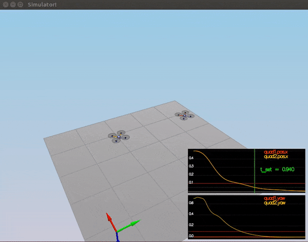
</p>

Performance Evaluation:

* X position of both drones should be within 0.1 meters of the target for at least 1.25 seconds
* Quad2 yaw should be within 0.1 of the target for at least 1 second

Result: 

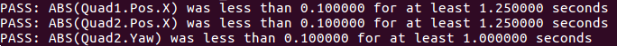

**Senario 4 : Non-idealities and robustness**

<p align="center">
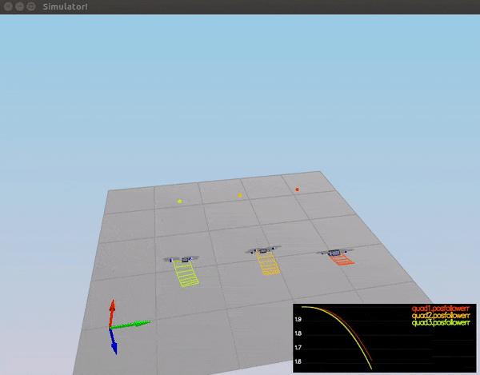
</p>

Performance Evaluation:

* position error for all 3 quads should be less than 0.1 meters for at least 1.5 seconds

Result: 


**Senario 5 : Trajectory Follow**

<p align="center">
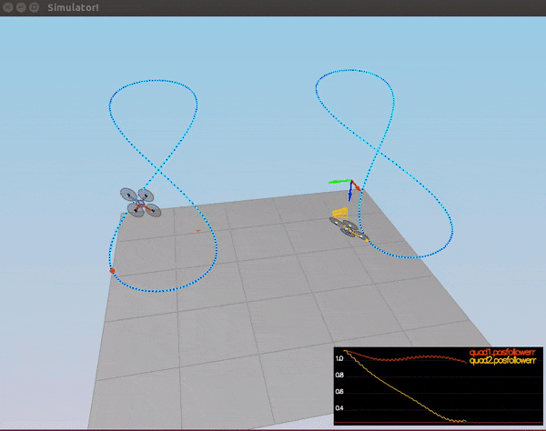
</p>

Performance Evaluation:

* position error of the quad should be less than 0.25 meters for at least 3 seconds

Result: 


**References**
* [1] https://github.com/udacity/FCND-Controls
* [2] A. P. Schoellig, C. Wiltsche and R. D’Andrea, 2012, "Feed-Forward Parameter Identification for Precise Periodic
   Quadrocopter Motions", American Control Confrence, Fairmont Queen Elizabeth, Montreal, Canada, 27-29 June 2012 
* [3] FCND Lesson 4 - 3D Drone-Full-Notebook ( [3D Controller Part](https://classroom.udacity.com/nanodegrees/nd787/parts/5aa0a956-4418-4a41-846f-cb7ea63349b3/modules/b78ec22c-5afe-444b-8719-b390bd2b2988/lessons/2263120a-a3c4-4b5a-9a96-ac3e1dbae179/concepts/47b0380b-3d5a-426b-8409-45f947c8f343#) ) 
* [4] [Python Tips & Tricks](https://classroom.udacity.com/nanodegrees/nd787/parts/5aa0a956-4418-4a41-846f-cb7ea63349b3/modules/b78ec22c-5afe-444b-8719-b390bd2b2988/lessons/81acb1ca-af00-4553-b8bb-b1467fbcfc51/concepts/74671657-bda5-4aff-a635-1fde48b15b33)
* [5] [FCND Lesson 12 - Section 17](https://classroom.udacity.com/nanodegrees/nd787/parts/5aa0a956-4418-4a41-846f-cb7ea63349b3/modules/b78ec22c-5afe-444b-8719-b390bd2b2988/lessons/dd98d695-14f1-40e0-adc5-e9fafe556f73/concepts/541ec6ae-f171-4195-9c05-97a5c82a85df)
* [6] [FCND Lesson 12 - Section 20](https://classroom.udacity.com/nanodegrees/nd787/parts/5aa0a956-4418-4a41-846f-cb7ea63349b3/modules/b78ec22c-5afe-444b-8719-b390bd2b2988/lessons/dd98d695-14f1-40e0-adc5-e9fafe556f73/concepts/376cb237-8c63-4be5-b5e2-ee628dab64cd#)
